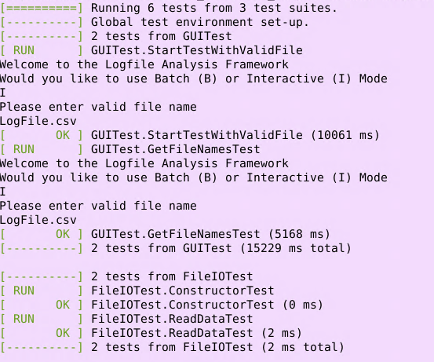
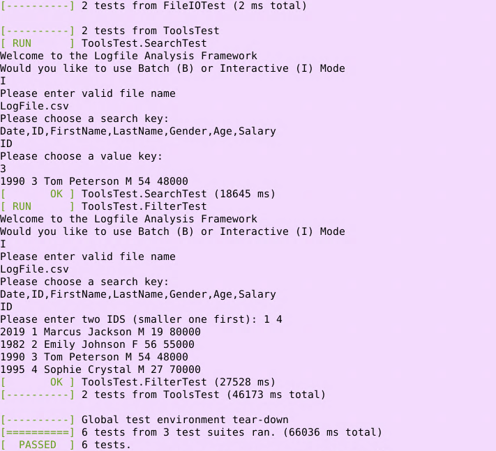

# Logfile Analysis Framework, v0.2

## Build and Execution
* It's assumed that the user is SSHed or using a CSE UMN lab machine
* The user must clone the repo using the following command: `git clone https://github.umn.edu/CAMPO193/5801_Project.git`
* The user should then navigate into the cloned repo using a terminal
* In order to build the app, the user must navigate into the `/project` directory using `cd project` and run the `make` command
* The app can then be run by running `./main`

* NOTE: The user MUST be in the `/project` directory within the repo to run the app

 

## Testing
* It's assumed that the user is SSHed or using a CSE UMN lab machine
* It is also assumed that the user has cloned down the repo per the instructions in [Build and Execution](#build-and-execution)
* The user should navigate to the base directory in the repo
* Once in the repo, the user should run `git submodule update --init --recursive`
* The user should then go into the `/build` directory using `cd build`
* The user should then run the following commands in order:
    * `cmake ..`
    * `make`
    * `./mytests`
* The tests should then be running
* Some tests require the user to give input in order for the tests to pass. Please refer to the images below for what the correct input is

 

 

* NOTE: The user MUST delete the CMakeCache.txt in order to run the tests from a different machine if the user moves the files to another machine

## Functionality
* Interactive mode is the only functional mode currently available as Batch mode isn't yet implemented
* Search and Filter are the only implemented features currently along with Quit
* Contextual Analysis is only possible when filtering on ID, Age, and Salary
   * Example of how to enter in a range for ID would be `1 4`
   * Example of how to enter in a range for Age would be `20 40`
   * Example of how to enter in a range for Salary would be `10000 100000`
* While ReadFile, WriteFile, and SaveFile are functional, their implementation is not yet complete

 

## Notes
* We only moved our stuff over to GitHub on May 1st, 2022. Before that we were working cooperatively through Replit as well as emailing each other the files. This is why the dates from out spreadsheet won't quite line up with our GitHub history.

 

## Contributors
* Zachary Guldberg (guldb016)
* Tyler Johnson-Vasquez (joh20191)
* Gabriel Campos (campo193)
* Marcus Taugner (taugn001)
